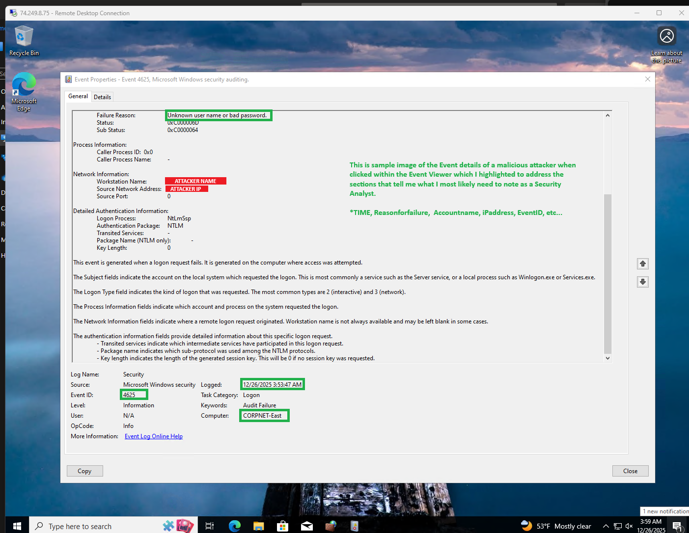

# Azure-Sentinel-Brute-Force-Detection-Lab

Hello! In this project, I deployed an Azure virtual machine in a controlled lab environment and intentionally exposed it to the internet to generate and collect failed login attempts. These logs were ingested into Microsoft Sentinel, where they were analyzed, enriched with GeoIP data, and visualized on a world map to identify potential brute-force activity. Throughout the project, I included notes between steps to clearly explain my thought process and decision-making. Key details were also annotated within the images to provide additional context and help others better understand both the technical implementation and security concepts demonstrated in this project.

  

The first step was to deploy a virtual machine in Microsoft Azure and configure its Network Security Group to allow inbound traffic by removing restrictive port rules. After deployment, I connected to the virtual machine using its public IP address and temporarily disabled the Windows Defender Firewall within the operating system for testing purposes.

This allowed the system to respond to ICMP echo requests, which are blocked by default when the Windows firewall is enabled. To validate external reachability and confirm the system’s exposure, an ICMP ping test was performed from a local machine using the VM’s public IP address.
 

  
  
Next, to generate failed authentication events, I disconnected from the virtual machine session and intentionally attempted to log in using incorrect credentials. After several failed attempts, I successfully authenticated and accessed the system. Using Windows Event Viewer, I filtered the security logs to display only failed login events associated with Event ID 4625, confirming that the authentication failures were being properly recorded.
  
 

  

  Sample Image of Extended Event Information (BELOW)
   
   

  

 The next step was to establish a centralized log repository for the virtual machine. This was accomplished by creating an Azure Log Analytics workspace and connecting it to the VM to collect security and system logs. Once the data source was configured, KQL queries were used to aggregate and analyze the logs directly from the virtual machine within the workspace.
     
  

  

 Next, Microsoft Sentinel was enabled on the Log Analytics workspace to configure advanced security monitoring. A Data Collection Rule (DCR) was created, and the appropriate data connector was added. For this project, the Windows Security Events via Azure Monitor Agent (AMA) connector was used from the Content Hub. This step is critical to ensure accurate log ingestion and effective SIEM monitoring.
    
  

  

 Right after install I made sure to check my extension and connectors for my virtual machine. 
 
  

  

  After completion I returned to the Log anlaytics workspace and took a look at the SecurityEvent logs. To enrich these logs beyond just their source IP Addresses I uploaded a spreadsheet containing GeoIP information for IP address ranges to a watchlist. This watchlist enabled geographic enrichment of security events based on source IP addresses.
  
  

  

The final steps involved creating a custom alert to detect failed login activity. This included defining the alert scope, setting the appropriate severity level, and associating an action group, all of which are visible and manageable through the Azure Monitor interface.
Future enhancements could include ingesting additional data sources and integrating alert and incident notifications into a centralized dashboard. This implementation represents a practical example of the type of monitoring and alerting workflows a Tier I Security Analyst may encounter in daily operations.

  

  
    
   

  
